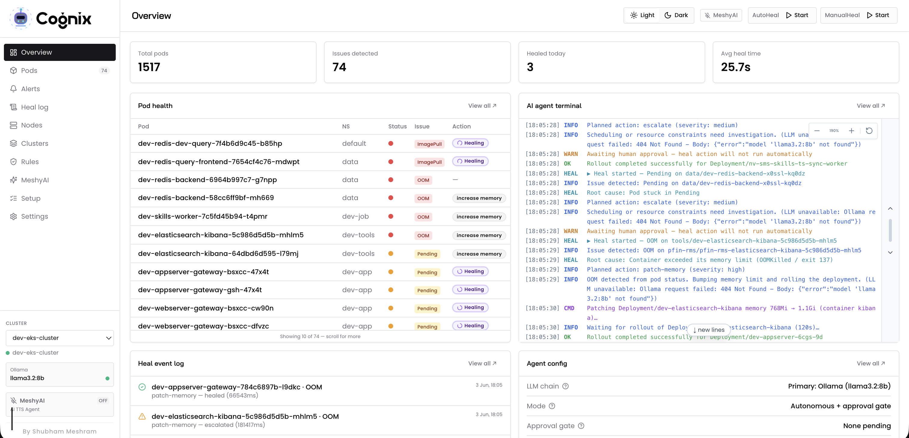

<p align="center">
  
</p>

<h1 align="center">Kubernetes Healing Agent</h1>

<p align="center">
  AI-assisted Kubernetes pod healing — watch unhealthy pods, diagnose with LLM, and heal automatically from a friendly dashboard with <strong>Meshy</strong> (AI copilot).
</p>

<p align="center">
  📖 <a href="docs/SETUP.md"><strong>Full setup guide</strong></a> (EC2, Docker, Kubernetes) — step-by-step for beginners, env file reference, copy-paste commands
</p>

## Application



## Quick start (Docker)

```bash
git clone https://github.com/YOUR_ORG/kubehealer.git
cd kubehealer
chmod +x scripts/ollama-pull.sh

# Agent env (repo root)
cp .env.example .env
# Edit: JWT_SECRET (openssl rand -base64 32), keep other defaults

# Web env
cp .env.web.example .env.web
# Edit: JWT_SECRET (same as agent), NEXTAUTH_* for login

docker compose up -d --build
```

Open **http://localhost:3000** → sidebar **Setup** → **Settings → Agent** → **Clusters**.

| Service | URL |
|---------|-----|
| Web | http://localhost:3000 |
| Agent | http://localhost:3001/health |
| Postgres | localhost:**5433** (user/pass/db: `kubehealer`) |
| Ollama | http://localhost:11434 |

## Install methods

| Method | Guide section |
|--------|----------------|
| **Cloud server (EC2 / VPS)** | [Setup §1](docs/SETUP.md#1-setup-on-a-server-ec2--vps) |
| **Docker Compose** | [Setup §2](docs/SETUP.md#2-setup-with-docker) |
| **Kubernetes (Helm)** | [Setup §3](docs/SETUP.md#3-setup-on-kubernetes-helm) · [helm/kubehealer](helm/kubehealer) |

## Environment files (summary)

| File | When |
|------|------|
| `.env` | Docker — agent |
| `.env.web` | Docker — web |
| `apps/agent/.env` | Local dev — agent |
| `apps/web/.env` | Local dev — web |

**Required keys:** `DATABASE_URL`, `JWT_SECRET`, `OLLAMA_URL` (agent) · `NEXT_PUBLIC_API_URL`, `JWT_SECRET` (web).

LLM keys, Teams, and most settings → **dashboard Settings** (not `.env`). Details: [Env file reference](docs/SETUP.md#environment-files--which-file-which-keys).

## Project structure

| Path | Description |
|------|-------------|
| `apps/web` | Next.js dashboard |
| `apps/agent` | Fastify agent + cluster watcher |
| `packages/shared` | Shared types |
| `helm/kubehealer` | Kubernetes Helm chart |
| `docs/SETUP.md` | Complete installation guide |

## Local development

```bash
pnpm install
pnpm --filter @kubehealer/shared build
cp apps/agent/.env.example apps/agent/.env
cp apps/web/.env.example apps/web/.env

docker compose up -d postgres ollama ollama-pull
pnpm dev:agent   # :3001
pnpm dev:web     # :3000
pnpm db:push
```

## Makefile

| Target | Description |
|--------|-------------|
| `make dev` | `docker compose up --build` |
| `make agent` | Agent hot reload |
| `make web` | Next.js dev server |
| `make db:push` | Push DB schema |
| `make logs` | Follow agent logs |

## Links

- [Complete setup guide](docs/SETUP.md)
- [Helm chart README](helm/kubehealer/README.md)
- [Ollama](https://ollama.com/) · [Docker](https://docs.docker.com/get-docker/) · [Helm](https://helm.sh/)
